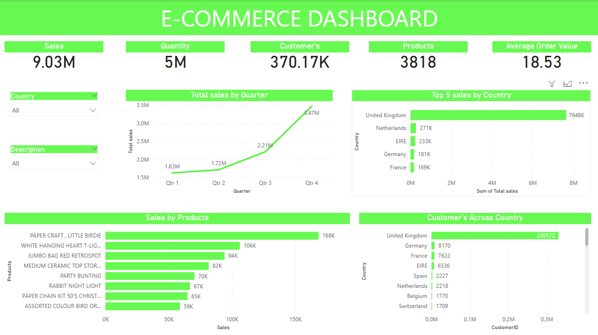

# E-Commerce Sales & Customer Behavior Analysis

Project Overview

This project analyzes an open-source e-commerce dataset to uncover key revenue drivers and customer behavior patterns. The goal is to derive actionable insights that can help improve sales, customer retention, and overall business performance. The analysis includes data cleaning, SQL-based data retrieval, exploratory data analysis (EDA), and predictive modeling.

Dataset

The dataset used in this project is based on the UCI Online Retail Dataset, which contains anonymized transaction records, including:

Invoice No (Unique transaction identifier)

Stock Code (Product identifier)

Description (Product description)

Quantity (Units purchased)

Invoice Date (Date of transaction)

Unit Price (Price per unit)

Customer ID (Unique customer identifier)

Country (Customer's location)

Project Workflow

1. Data Ingestion & Cleaning (Python)

- Load and explore the dataset.

- Handle missing values, remove duplicates, and correct data types.

- Remove invalid entries (e.g., negative quantities or prices).

- Generate a cleaned dataset for further analysis.

2. Exploratory Data Analysis (Excel)

- Export relevant data from SQL to Excel.

- Create pivot tables and charts for:

- Monthly/quarterly sales trends.

- Geographic distribution of customers.

- Performance by product categories.

-  Highlight key insights such as seasonality and top customer segments

3. Exploratory Data Analysis & Visualization (Power BI)

- Power BI Dashboard Highlights:

-  Sales Metrics: Total sales, quantity sold, number of customers, and average order value.

-  Sales Trends: Quarterly sales growth with a clear upward trend in Q4.

-  Top Sales by Country: The United Kingdom leads in sales, followed by the Netherlands, Ireland, Germany, and France.

-  Top-Selling Products: Identifies high-performing products based on sales volume.

-  Customer Distribution: Shows the concentration of customers across different countries, with the UK having the largest customer base.

4. Predictive Modeling (Machine Learning)

-  Build a classification model to predict repeat purchases.

-  Split data into training and testing sets.

-  Train models like Logistic Regression, Random Forest 

-  Evaluate performance using accuracy, precision, recall, and F1-score.

Deliverables

-  Python Scripts/Jupyter Notebooks for data cleaning, analysis, and modeling.

-  Power BI Dashboard with interactive visualizations.

-  Logistic Regression and RandomForest for training model 

Installation & Usage

Prerequisites

-  Python (Pandas, NumPy, Matplotlib, Seaborn, Scikit-learn, SQLAlchemy)

-  Power BI (for visualization and dashboards)

 
